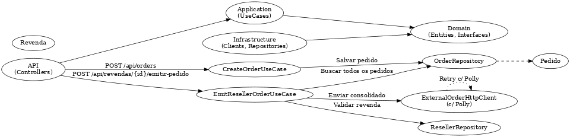

# 🚀 ResellFlow API

API para gerenciamento de revendas, onde clientes enviam pedidos para suas respectivas revendas. A revenda pode, posteriormente, emitir um pedido consolidado para um sistema externo.

---

## 🧱 Arquitetura

A aplicação segue os princípios de:

- ✅ Arquitetura Hexagonal (Ports & Adapters)
- ✅ Clean Code
- ✅ SOLID
- ✅ Injeção de Dependência (nativa do .NET)
- ✅ Validações com FluentValidation
- ✅ Resiliência com Polly (retry/fallback)

---

## 🔁 Fluxograma da Solução



---

## 🧩 Módulos

### 1. Cadastro de Revenda
- `POST /api/resellers`
- Validações: CNPJ, e-mail, telefone, etc.
- Campos aninhados:
  ```json
  {
    "contacts": [
      { "name": "Fulano", "email": "fulano@email.com" }
    ],
    "deliveryAddresses": [
      {
        "street": "Rua X",
        "district": "Bairro Y",
        "city": "São Paulo",
        "state": "SP",
        "zipCode": "01234-567",
        "number": "100",
        "complement": "Sala 2"
      }
    ]
  }
  ```

### 2. Criação de Pedido
- `POST /api/orders`
- Cada pedido é associado a uma revenda via `clientIdentifier`
  ```json
  {
    "clientIdentifier": "revenda-xyz",
    "items": [
      { "product": "Produto A", "quantity": 400 },
      { "product": "Produto B", "quantity": 600 }
    ]
  }
  ```

### 3. Emissão de Pedido Consolidado da Revenda
- `POST /api/revendas/{clientIdentifier}/emitir-pedido`
- Soma todas as quantidades de todos os pedidos da revenda
- Valida se soma ≥ 1000
- Envia para sistema externo
- Exemplo de resposta:
  ```json
  {
    "orderId": "EXT-123456",
    "items": [
      { "product": "Produto A", "quantity": 400 },
      { "product": "Produto B", "quantity": 600 }
    ]
  }
  ```

---

## 🧪 Testes

- Validação de criação de revenda
- Pedido com lista de itens válida/inválida
- Emissão consolidada:
  - Soma < 1000 → erro
  - Soma ≥ 1000 → sucesso (mockado)

Execute os testes com:

```bash
dotnet test
```

---

## 🐳 Como rodar

```bash
docker-compose up --build
```

Swagger disponível em: `http://localhost:5000/swagger`

---

## 📂 Estrutura

```
ResellFlow.Api             -> Controllers, Program.cs
ResellFlow.Application     -> UseCases, DTOs, Validators
ResellFlow.Domain          -> Entidades e Interfaces
ResellFlow.Infrastructure  -> Repositórios e Clients
ResellFlow.Tests           -> Testes unitários (xUnit)
```

---

## 🔗 Observações

- Repositório em memória para simulação
- Envio externo é mockado e instável com Polly
- A rota antiga `POST /api/orders/{id}/send-to-resell-flow` foi descontinuada
